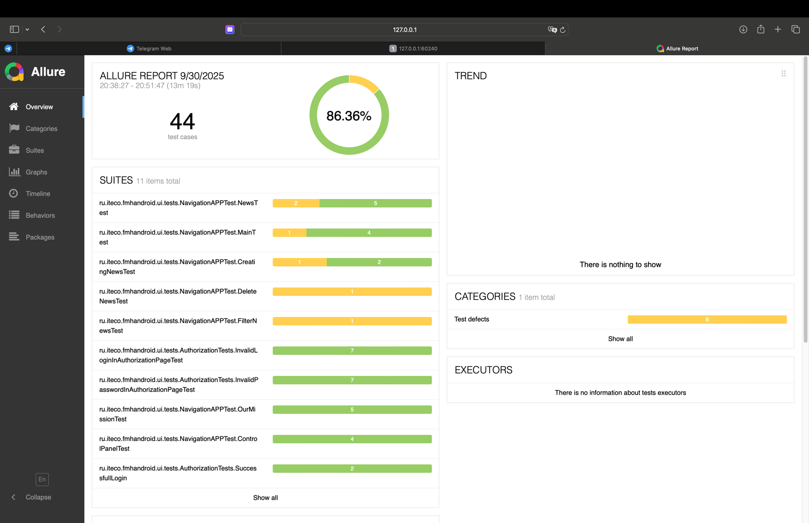

# Отчет о тестировании
В рамках этого проекта было проведено тестирование приложения "вхосписе".

## Тест-кейсы
Было автоматизировано 44 тест-кейсов.

## Успешность тест-кейсов
Из 44 тест-кейсов: 6 не прошли, 38 прошли.

### Итог:
*На ручное тестирование потрачено времени: 45 минут*
*На автоматизированое тестирование потрачено времени: 13 минут*

Автоматизированное тестирование значительно быстрее, эффективнее и обеспечивает более высокую 
повторяемость, что делает его предпочтительным по сравнению с ручным тестированием. 
Но ручное тестирование надежнее.

## Общие рекомендации по итогам тестирования
1. Добавить к полям авторизации подпись под полями какие буквы и символы можно вводить.
Так же установить ограничения по количеству символов.
2. Добавить на все элементы страниц id.
3. Исправить, возможность добавления новостей
4. Поменять кнопку News в меню, сделать ее не активной, а сделать доступной кнопку About в разделе 
News.
5. Формы фильтров, добавления новостей локализировать
6. В разделе Control panel у новостей доработать отображение выбранной даты
7. В разделе About сделать переходы по ссылкам успешными
8. Пополнить раздел About актуальной информацией о приложении. Добавить тайтл, кнопки: выхода из аккаунта, 
переход в цитаты, и меню разделов.
9. В формах, фильтров и добавления новостей, доработать список категорий - нет возможности 
автоматизации выбора категории.
10. Запретить, в формах, ввод в поля: Категория, дата публикации, время, что-либо по-мимо базовых 
возможностей полей.
